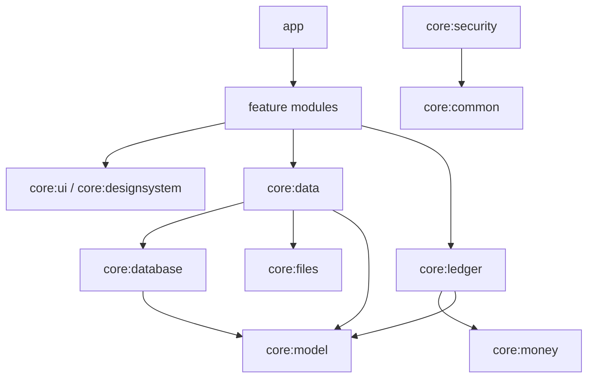
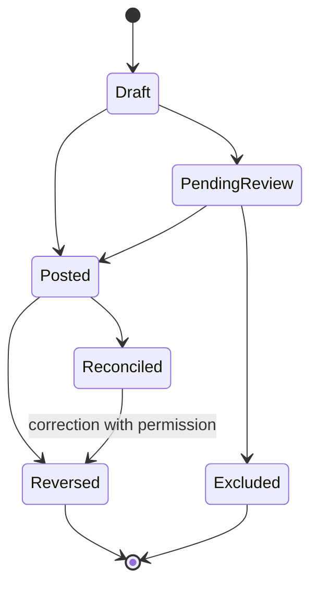
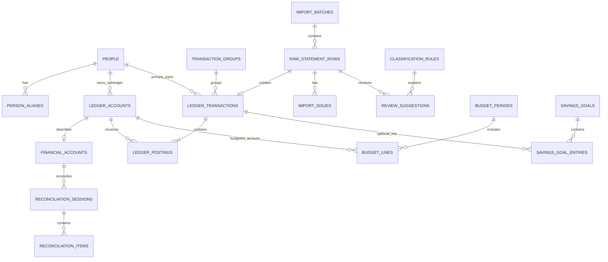

# Phase 02 — Technical Architecture and Database Design

**Project:** Salah Finance Manager  
**Document:** Technical Architecture and Database Design  
**Status:** Approved Technical Baseline  
**Date:** 23 July 2026  
**Product Owner:** Salah Abu Saif  
**Target Platform:** Android  
**Application Type:** Native, offline-first, single-user  
**Primary Language:** Kotlin  
**UI:** Jetpack Compose  
**Database:** Room over SQLite  
**Default App Language:** Arabic  
**Supported Languages:** Arabic and English  

---

## 1. Phase Objective

This phase converts the approved product requirements into an implementation-ready technical design.

It defines:

- The Android application architecture.
- The financial ledger model.
- The database structure.
- The money and date representations.
- Transaction posting rules.
- People and account relationships.
- Bank statement import architecture.
- Duplicate detection.
- Reconciliation.
- Budgeting and savings storage.
- Audit and correction behavior.
- Backup and security boundaries.
- Module ownership.
- Testing strategy.
- Technical acceptance criteria.

No Android UI implementation starts before the financial rules and data model in this document are approved.

---

## 2. Primary Architecture Decision

The application will use a **double-entry ledger internally** while exposing simple user-facing actions such as:

- Add deposit.
- Record withdrawal.
- Record debt.
- Record repayment.
- Transfer using a wallet.
- Add salary.
- Record personal expense.
- Transfer between accounts.
- Exchange USD to ILS.

The user will not manually create debit and credit entries. The application will generate balanced postings from safe transaction templates.

### Why this decision is required

A simple table containing only positive and negative amounts is not sufficient because the application must distinguish between:

- Real money in a bank or wallet.
- Money belonging to the user.
- Money held for another person.
- Money owed to the user.
- Money owed by the user.
- Personal income.
- Personal expenses.
- Internal transfers.
- Currency exchanges.
- Wallet commission income.
- Reversals and corrections.

The double-entry ledger provides the following invariants:

1. Every posted transaction is balanced.
2. Money cannot appear or disappear without a trace.
3. Internal transfers do not become false income or expenses.
4. Personal money remains separate from entrusted money.
5. Corrections can be reversed and audited.
6. Account balances can always be rebuilt from transaction history.

---

## 3. Architectural Style

The application will use:

- Single-activity architecture.
- Jetpack Compose for UI.
- Unidirectional Data Flow.
- Screen-level ViewModels.
- StateFlow for observable UI state.
- Repository-based data access.
- A domain layer for financial use cases.
- Room as the local source of truth.
- Proto DataStore for application preferences.
- Hilt for dependency injection.
- WorkManager for persistent background work.
- Android Keystore for cryptographic key protection.
- Navigation 3 when a stable release is available at implementation time.
- Current stable Navigation Compose as the fallback.
- Stable dependencies only unless an exception is explicitly approved.

The application is offline-first. Room is the canonical source read by the rest of the application.

---

## 4. Proposed Android Configuration

The exact SDK and dependency versions will be pinned during the Android project bootstrap phase.

### Proposed baseline

- **Application ID:** `com.salahabusaif.financemanager`
- **Project Name:** `SalahFinanceManager`
- **Minimum SDK:** API 26
- **Compile SDK:** Latest stable at Phase 04 implementation time
- **Target SDK:** Latest stable required at Phase 04 implementation time
- **JDK:** Current Android-supported LTS version
- **Gradle scripts:** Kotlin DSL
- **Dependency management:** Gradle Version Catalog
- **Annotation processing:** KSP where supported
- **UI framework:** Material 3 + Jetpack Compose
- **Database file:** `salah_finance.db`
- **Initial database version:** 1

### Dependency policy

- Do not use alpha, beta, RC, snapshot, or unpublished dependencies without approval.
- Pin all versions.
- Store versions in `gradle/libs.versions.toml`.
- Run dependency update checks intentionally; do not auto-upgrade financial dependencies.
- Every database or cryptography dependency change requires regression tests.

---

## 5. Project Module Structure

The application will use moderate multi-module architecture.

It will avoid both extremes:

- One large monolithic `app` module.
- Excessive micro-modules that slow development without clear ownership.

### Proposed modules

```text
android-app/
├── app
├── core/
│   ├── common
│   ├── model
│   ├── money
│   ├── ledger
│   ├── database
│   ├── data
│   ├── designsystem
│   ├── ui
│   ├── files
│   ├── security
│   └── testing
└── feature/
    ├── dashboard
    ├── accounts
    ├── people
    ├── transactions
    ├── import
    ├── review
    ├── reconciliation
    ├── budget
    ├── savings
    ├── reports
    └── settings
```

### Module responsibilities

| Module | Responsibility |
|---|---|
| `app` | Application entry point, dependency assembly, top-level navigation |
| `core:common` | Result types, dispatchers, clocks, validators, shared utilities |
| `core:model` | Shared domain models and enums |
| `core:money` | Money, currency, exchange rate, rounding rules |
| `core:ledger` | Posting engine, balancing rules, transaction templates |
| `core:database` | Room entities, DAOs, database, migrations |
| `core:data` | Repository implementations and data mapping |
| `core:designsystem` | Theme, typography, colors, icons, reusable components |
| `core:ui` | Shared UI states, formatting, adaptive layout helpers |
| `core:files` | File selection, statement parsers, export and backup I/O |
| `core:security` | App lock, Keystore integration, backup encryption |
| `core:testing` | Fakes, fixtures, test builders, sample clocks |
| `feature:*` | Complete user-facing vertical slices |

### Dependency direction



Rules:

- A feature module must not access a Room DAO directly.
- A Composable must not access a repository directly.
- A ViewModel must not depend on Android `Activity`, `Fragment`, or `Resources`.
- Financial posting rules belong in `core:ledger`, not in ViewModels.
- Formatting belongs in UI modules; amounts remain raw and locale-neutral in the domain layer.

---

## 6. Layer Design

### 6.1 UI Layer

Contains:

- Compose screens.
- UI components.
- ViewModels.
- UI state.
- UI actions.
- Navigation callbacks.
- Presentation mapping.

Pattern:

```text
User Action
    ↓
ViewModel
    ↓
Use Case
    ↓
Repository
    ↓
Room transaction
    ↓
Flow emits updated data
    ↓
ViewModel UI State
    ↓
Compose renders
```

### 6.2 Domain Layer

Contains reusable business rules:

- Post transaction.
- Reverse transaction.
- Calculate commission.
- Calculate person summary.
- Create internal transfer.
- Create currency exchange.
- Close month.
- Validate reconciliation.
- Build WhatsApp statement.
- Import and classify statement rows.
- Calculate safe daily budget.

Domain use cases must be pure Kotlin whenever possible.

### 6.3 Data Layer

Contains:

- Repository implementations.
- Room DAOs.
- DataStore access.
- Import parser adapters.
- Backup file adapters.
- Entity-to-domain mapping.
- Database transactions.

### 6.4 Source of Truth

- Room is the canonical source of business and ledger data.
- Proto DataStore stores small application preferences.
- Imported files are external inputs, not sources of live balances.
- UI state must be derived from repositories observing Room.

---

## 7. Money Representation

Financial amounts must never use `Float` or `Double`.

### 7.1 Stored amount

Use a signed or unsigned `Long` representing minor units:

- 1 ILS = 100 agorot.
- 1 USD = 100 cents.
- 201.50 ILS = `20150`.

Domain type:

```kotlin
data class Money(
    val minorUnits: Long,
    val currency: CurrencyCode,
)
```

### 7.2 Currency

Initial currencies:

```kotlin
enum class CurrencyCode {
    ILS,
    USD,
}
```

The database should store ISO currency codes as text for future extensibility.

### 7.3 Exchange rate

Exchange rates use `BigDecimal` in the domain layer and are stored as a normalized decimal string.

Example:

```text
3.31400000
```

Every conversion requires:

- Source amount.
- Target amount.
- Source currency.
- Target currency.
- Exchange rate.
- Rounding mode.
- Date.
- Optional fee.

### 7.4 Arithmetic safety

The money module must provide:

- Checked addition.
- Checked subtraction.
- Currency equality validation.
- Allocation with deterministic remainder handling.
- Percentage calculations with an explicit rounding mode.
- Safe conversion from user text.
- Locale-aware formatting outside the domain layer.

---

## 8. Date and Time Representation

The application must distinguish between:

- Accounting date.
- Bank posting date.
- Effective date.
- Creation timestamp.
- Modification timestamp.
- Import timestamp.

Storage rules:

- `LocalDate` values are stored as `epochDay: Long`.
- `Instant` values are stored as `epochMillis: Long`.
- The user's selected time zone is stored in DataStore.
- The original imported date text is preserved.
- Suspicious dates are flagged rather than silently changed.

---

## 9. Ledger Model

### 9.1 Ledger account types

```kotlin
enum class LedgerAccountType {
    ASSET,
    LIABILITY,
    EQUITY,
    INCOME,
    EXPENSE,
    CLEARING,
}
```

### 9.2 Ledger account roles

Examples:

```kotlin
enum class LedgerAccountRole {
    BANK,
    WALLET,
    CASH,
    SAVINGS_ASSET,
    PERSON_FUNDS_HELD,
    PERSON_RECEIVABLE,
    PERSONAL_PAYABLE,
    SALARY_INCOME,
    OTHER_INCOME,
    COMMISSION_INCOME,
    EXPENSE_CATEGORY,
    FX_CLEARING,
    TRANSFER_CLEARING,
    OPENING_BALANCE_EQUITY,
    SUSPENSE,
}
```

### 9.3 Normal balance

| Account Type | Normal Balance |
|---|---|
| Asset | Debit |
| Expense | Debit |
| Liability | Credit |
| Equity | Credit |
| Income | Credit |
| Clearing | Defined by role and expected to return to zero |

### 9.4 Transaction, entry, and posting

The model uses:

- `TransactionGroup`: links related transactions, especially currency exchange.
- `LedgerTransaction`: user-visible and auditable financial event.
- `LedgerPosting`: debit or credit line against a ledger account.

Rules:

- Every posted transaction must balance.
- All postings inside one ledger transaction must use the same currency.
- A currency exchange is represented by linked balanced transactions, one per currency.
- A draft may be edited.
- A posted transaction cannot be silently edited.
- A financial correction creates a reversal and a replacement.

---

## 10. Transaction Lifecycle



### States

| State | Meaning |
|---|---|
| `DRAFT` | Not financially active |
| `PENDING_REVIEW` | Imported or incomplete |
| `POSTED` | Included in balances |
| `RECONCILED` | Confirmed against real account statement |
| `REVERSED` | Financial effect canceled by linked reversal |
| `EXCLUDED` | Raw movement intentionally excluded |
| `FAILED` | Import or posting failure with no financial effect |

### Editing policy

- Draft: editable.
- Pending review: editable.
- Posted: non-financial metadata may be updated.
- Posted financial changes: reverse and replace.
- Reconciled: correction requires explicit warning and audit.
- Closed-period transaction: correction only through a dated adjustment.

---

## 11. Core Posting Rules

In the examples below, “Debit” and “Credit” are generated internally. The UI continues to use simple Arabic and English actions.

### 11.1 Person deposits money to be held

Person deposits 1,000 ILS into the user's bank account.

| Account | Debit | Credit |
|---|---:|---:|
| Bank ILS | 1,000 | 0 |
| Funds Held for Person — ILS | 0 | 1,000 |

Result:

- Bank increases by 1,000.
- The person has 1,000 with the user.
- Personal income does not increase.

### 11.2 Wallet transfer from a person's held funds

Transfer 200 ILS with a 1.5 ILS commission.

| Account | Debit | Credit |
|---|---:|---:|
| Funds Held for Person — ILS | 201.5 | 0 |
| PalPay Wallet | 0 | 200 |
| Commission Income | 0 | 1.5 |

Result:

- Wallet decreases by 200.
- Person's held balance decreases by 201.5.
- User earns 1.5 commission.

### 11.3 Wallet transfer recorded as debt

User pays 200 ILS for a person who has no held balance.

| Account | Debit | Credit |
|---|---:|---:|
| Receivable from Person — ILS | 201.5 | 0 |
| PalPay Wallet | 0 | 200 |
| Commission Income | 0 | 1.5 |

Result:

- The person owes the user 201.5.
- Wallet decreases by 200.
- Commission income is 1.5.

### 11.4 Mixed settlement

If a person has only 100 ILS held and requests a 200 ILS transfer plus commission:

| Account | Debit | Credit |
|---|---:|---:|
| Funds Held for Person | 100 | 0 |
| Receivable from Person | 101.5 | 0 |
| Wallet | 0 | 200 |
| Commission Income | 0 | 1.5 |

The application must require confirmation before creating debt automatically.

### 11.5 User gives a loan

User lends 300 ILS to a person.

| Account | Debit | Credit |
|---|---:|---:|
| Receivable from Person | 300 | 0 |
| Bank or Cash | 0 | 300 |

### 11.6 Person repays a loan

Person repays 100 ILS.

| Account | Debit | Credit |
|---|---:|---:|
| Bank or Cash | 100 | 0 |
| Receivable from Person | 0 | 100 |

### 11.7 Salary

User receives a salary of 1,200 ILS.

| Account | Debit | Credit |
|---|---:|---:|
| Bank ILS | 1,200 | 0 |
| Salary Income | 0 | 1,200 |

### 11.8 Personal expense

User spends 50 ILS on groceries.

| Account | Debit | Credit |
|---|---:|---:|
| Groceries Expense | 50 | 0 |
| Bank, Wallet, or Cash | 0 | 50 |

### 11.9 Internal transfer

Transfer 200 ILS from Bank ILS to PalPay.

| Account | Debit | Credit |
|---|---:|---:|
| PalPay Wallet | 200 | 0 |
| Bank ILS | 0 | 200 |

No income or expense is created.

### 11.10 Currency exchange

Exchange 500 USD into 1,657 ILS.

USD transaction:

| Account | Debit | Credit |
|---|---:|---:|
| FX Clearing — USD | 500 USD | 0 |
| Bank USD | 0 | 500 USD |

ILS transaction:

| Account | Debit | Credit |
|---|---:|---:|
| Bank ILS | 1,657 ILS | 0 |
| FX Clearing — ILS | 0 | 1,657 ILS |

Both transactions share one `TransactionGroup`.

### 11.11 Reversal

A reversal creates opposite postings and links to the original transaction.

The original record remains unchanged.

---

## 12. Person Balance Model

For each person and currency, the system creates or resolves two ledger accounts:

1. `PERSON_FUNDS_HELD`
2. `PERSON_RECEIVABLE`

Example:

```text
Hamoud — Funds Held — ILS
Hamoud — Receivable — ILS
Hamoud — Funds Held — USD
Hamoud — Receivable — USD
```

### Display values

- **Has with me:** credit balance of `PERSON_FUNDS_HELD`.
- **Owes me:** debit balance of `PERSON_RECEIVABLE`.
- **Optional net:** calculated for display only and never stored as the source balance.

The system must never combine ILS and USD without an explicit display exchange rate.

---

## 13. Database Overview

The database is divided into the following areas:

1. People and aliases.
2. Ledger and transactions.
3. Real financial accounts.
4. Imports and review.
5. Reconciliation.
6. Budget and savings.
7. Period closing.
8. Audit and attachments.
9. Configuration and commission rules.

---

## 14. Database Entities

### 14.1 `people`

| Column | Type | Rules |
|---|---|---|
| `id` | TEXT UUID | Primary key |
| `displayName` | TEXT | Required |
| `personType` | TEXT | PERSON or ORGANIZATION |
| `nickname` | TEXT | Optional |
| `phoneNumber` | TEXT | Optional |
| `photoPath` | TEXT | Optional app-private path |
| `notes` | TEXT | Optional |
| `hasFinancialAccount` | INTEGER | Boolean |
| `isArchived` | INTEGER | Boolean |
| `createdAt` | INTEGER | Epoch millis |
| `updatedAt` | INTEGER | Epoch millis |

Indexes:

- `displayName`
- `hasFinancialAccount`
- `isArchived`

### 14.2 `person_aliases`

| Column | Type | Rules |
|---|---|---|
| `id` | TEXT UUID | Primary key |
| `personId` | TEXT UUID | Foreign key |
| `alias` | TEXT | Required |
| `normalizedAlias` | TEXT | Required |
| `source` | TEXT | MANUAL or LEARNED |
| `createdAt` | INTEGER | Epoch millis |

Constraints:

- Unique `(personId, normalizedAlias)`.
- Index `normalizedAlias`.

### 14.3 `ledger_accounts`

| Column | Type | Rules |
|---|---|---|
| `id` | TEXT UUID | Primary key |
| `code` | TEXT | Unique |
| `name` | TEXT | Required |
| `type` | TEXT | Asset, liability, etc. |
| `role` | TEXT | Bank, wallet, person funds, etc. |
| `currencyCode` | TEXT | ISO code |
| `personId` | TEXT UUID | Optional foreign key |
| `parentAccountId` | TEXT UUID | Optional |
| `normalBalance` | TEXT | DEBIT or CREDIT |
| `isSystem` | INTEGER | Boolean |
| `isActive` | INTEGER | Boolean |
| `createdAt` | INTEGER | Epoch millis |
| `updatedAt` | INTEGER | Epoch millis |

Constraints:

- Unique `code`.
- Person account role uniqueness per `(personId, role, currencyCode)`.
- Index `(type, currencyCode)`.
- Index `(personId, currencyCode)`.

### 14.4 `financial_accounts`

Metadata for real accounts such as Bank of Palestine and wallets.

| Column | Type | Rules |
|---|---|---|
| `id` | TEXT UUID | Primary key |
| `ledgerAccountId` | TEXT UUID | Unique foreign key |
| `institutionName` | TEXT | Optional |
| `accountKind` | TEXT | BANK, WALLET, CASH |
| `maskedAccountNumber` | TEXT | Optional |
| `providerCode` | TEXT | Optional |
| `openingBalanceMinor` | INTEGER | Long |
| `lastStatementBalanceMinor` | INTEGER | Optional |
| `lastStatementDate` | INTEGER | Optional epoch day |
| `lastReconciledAt` | INTEGER | Optional |
| `colorToken` | TEXT | Optional |
| `iconToken` | TEXT | Optional |
| `isArchived` | INTEGER | Boolean |

### 14.5 `transaction_groups`

| Column | Type | Rules |
|---|---|---|
| `id` | TEXT UUID | Primary key |
| `groupType` | TEXT | FX, linked transfer, correction |
| `reference` | TEXT | Optional |
| `notes` | TEXT | Optional |
| `createdAt` | INTEGER | Epoch millis |

### 14.6 `ledger_transactions`

| Column | Type | Rules |
|---|---|---|
| `id` | TEXT UUID | Primary key |
| `groupId` | TEXT UUID | Optional foreign key |
| `transactionType` | TEXT | Required |
| `status` | TEXT | Required |
| `reviewStatus` | TEXT | Required |
| `accountingDate` | INTEGER | Epoch day |
| `occurredAt` | INTEGER | Optional epoch millis |
| `primaryPersonId` | TEXT UUID | Optional |
| `beneficiaryPersonId` | TEXT UUID | Optional |
| `beneficiaryName` | TEXT | Optional raw name |
| `description` | TEXT | Required |
| `notes` | TEXT | Optional |
| `source` | TEXT | MANUAL, BANK_IMPORT, WALLET_IMPORT |
| `externalReference` | TEXT | Optional |
| `rawImportRowId` | TEXT UUID | Optional |
| `reversalOfId` | TEXT UUID | Optional |
| `replacedById` | TEXT UUID | Optional |
| `postedAt` | INTEGER | Optional |
| `reconciledAt` | INTEGER | Optional |
| `createdAt` | INTEGER | Epoch millis |
| `updatedAt` | INTEGER | Epoch millis |
| `version` | INTEGER | Optimistic version |

Indexes:

- `accountingDate`
- `primaryPersonId`
- `status`
- `rawImportRowId`
- `externalReference`
- `(accountingDate, transactionType)`

### 14.7 `ledger_postings`

| Column | Type | Rules |
|---|---|---|
| `id` | TEXT UUID | Primary key |
| `transactionId` | TEXT UUID | Foreign key |
| `ledgerAccountId` | TEXT UUID | Foreign key |
| `direction` | TEXT | DEBIT or CREDIT |
| `amountMinor` | INTEGER | Positive Long |
| `currencyCode` | TEXT | Must match ledger account |
| `memo` | TEXT | Optional |
| `sequence` | INTEGER | Stable display order |
| `createdAt` | INTEGER | Epoch millis |

Constraints:

- `amountMinor > 0`.
- Unique `(transactionId, sequence)`.
- Index `transactionId`.
- Index `(ledgerAccountId, transactionId)`.

The domain engine must verify:

```text
Sum(Debits) = Sum(Credits)
```

before posting.

### 14.8 `wallet_commission_rules`

| Column | Type | Rules |
|---|---|---|
| `id` | TEXT UUID | Primary key |
| `walletProvider` | TEXT | PalPay, Jawwal Pay, custom |
| `currencyCode` | TEXT | ILS initially |
| `minimumMinor` | INTEGER | Inclusive |
| `maximumMinor` | INTEGER | Inclusive or null |
| `commissionMinor` | INTEGER | Fixed fee |
| `validFrom` | INTEGER | Epoch day |
| `validTo` | INTEGER | Optional |
| `isActive` | INTEGER | Boolean |
| `createdAt` | INTEGER | Epoch millis |

Rules must not overlap for the same provider, currency, and validity period.

### 14.9 `import_batches`

| Column | Type | Rules |
|---|---|---|
| `id` | TEXT UUID | Primary key |
| `fileName` | TEXT | Required |
| `fileSha256` | TEXT | Required |
| `sourceAccountId` | TEXT UUID | Optional before review |
| `detectedCurrency` | TEXT | Optional |
| `statementStartDate` | INTEGER | Optional |
| `statementEndDate` | INTEGER | Optional |
| `status` | TEXT | Parsing lifecycle |
| `totalRows` | INTEGER | Default 0 |
| `newRows` | INTEGER | Default 0 |
| `duplicateRows` | INTEGER | Default 0 |
| `warningRows` | INTEGER | Default 0 |
| `failedRows` | INTEGER | Default 0 |
| `startedAt` | INTEGER | Epoch millis |
| `completedAt` | INTEGER | Optional |
| `parserVersion` | TEXT | Required |
| `errorMessage` | TEXT | Optional |

### 14.10 `raw_statement_rows`

| Column | Type | Rules |
|---|---|---|
| `id` | TEXT UUID | Primary key |
| `batchId` | TEXT UUID | Foreign key |
| `rowNumber` | INTEGER | Required |
| `rawBankDate` | TEXT | Preserved |
| `rawEffectiveDate` | TEXT | Preserved |
| `parsedBankDate` | INTEGER | Optional epoch day |
| `parsedEffectiveDate` | INTEGER | Optional epoch day |
| `rawDescription` | TEXT | Preserved |
| `normalizedDescription` | TEXT | Search and fingerprint |
| `debitMinor` | INTEGER | Optional |
| `creditMinor` | INTEGER | Optional |
| `runningBalanceMinor` | INTEGER | Optional |
| `currencyCode` | TEXT | Required |
| `referenceNumber` | TEXT | Optional |
| `fingerprint` | TEXT | Required |
| `parseStatus` | TEXT | Required |
| `reviewStatus` | TEXT | Required |
| `duplicateOfRowId` | TEXT UUID | Optional |
| `linkedTransactionId` | TEXT UUID | Optional |
| `warningCodes` | TEXT | JSON string or normalized child rows |
| `createdAt` | INTEGER | Epoch millis |

Constraints:

- Unique `(batchId, rowNumber)`.
- Index `referenceNumber`.
- Index `fingerprint`.
- Index `reviewStatus`.
- Index `linkedTransactionId`.

### 14.11 `import_issues`

| Column | Type | Rules |
|---|---|---|
| `id` | TEXT UUID | Primary key |
| `batchId` | TEXT UUID | Foreign key |
| `rawRowId` | TEXT UUID | Optional |
| `severity` | TEXT | INFO, WARNING, ERROR |
| `code` | TEXT | Stable issue code |
| `message` | TEXT | Human-readable |
| `details` | TEXT | Optional JSON |
| `createdAt` | INTEGER | Epoch millis |

### 14.12 `classification_rules`

| Column | Type | Rules |
|---|---|---|
| `id` | TEXT UUID | Primary key |
| `name` | TEXT | Required |
| `matchType` | TEXT | Contains, exact, regex, reference |
| `matchValue` | TEXT | Required |
| `targetPersonId` | TEXT UUID | Optional |
| `targetBeneficiaryId` | TEXT UUID | Optional |
| `targetTransactionType` | TEXT | Optional |
| `targetLedgerAccountId` | TEXT UUID | Optional |
| `priority` | INTEGER | Required |
| `isEnabled` | INTEGER | Boolean |
| `suggestOnly` | INTEGER | Must default true |
| `createdAt` | INTEGER | Epoch millis |
| `updatedAt` | INTEGER | Epoch millis |

The first release must use suggestion-only behavior.

### 14.13 `review_suggestions`

Stores explainable suggestions generated for a raw row.

| Column | Type | Rules |
|---|---|---|
| `id` | TEXT UUID | Primary key |
| `rawRowId` | TEXT UUID | Foreign key |
| `suggestionType` | TEXT | Person, category, type, beneficiary |
| `suggestedValueId` | TEXT | Optional foreign identifier |
| `suggestedText` | TEXT | Optional |
| `confidenceBasisPoints` | INTEGER | 0–10000 |
| `explanation` | TEXT | Required |
| `ruleId` | TEXT UUID | Optional |
| `createdAt` | INTEGER | Epoch millis |
| `acceptedAt` | INTEGER | Optional |
| `rejectedAt` | INTEGER | Optional |

### 14.14 `reconciliation_sessions`

| Column | Type | Rules |
|---|---|---|
| `id` | TEXT UUID | Primary key |
| `financialAccountId` | TEXT UUID | Foreign key |
| `statementDate` | INTEGER | Epoch day |
| `statementBalanceMinor` | INTEGER | Required |
| `calculatedBalanceMinor` | INTEGER | Required snapshot |
| `differenceMinor` | INTEGER | Required |
| `currencyCode` | TEXT | Required |
| `status` | TEXT | OPEN, BALANCED, CLOSED |
| `notes` | TEXT | Optional |
| `createdAt` | INTEGER | Epoch millis |
| `closedAt` | INTEGER | Optional |

### 14.15 `reconciliation_items`

| Column | Type | Rules |
|---|---|---|
| `id` | TEXT UUID | Primary key |
| `sessionId` | TEXT UUID | Foreign key |
| `transactionId` | TEXT UUID | Optional |
| `rawRowId` | TEXT UUID | Optional |
| `itemType` | TEXT | Included, missing, excluded, adjustment |
| `amountMinor` | INTEGER | Required |
| `notes` | TEXT | Optional |

### 14.16 `budget_periods`

| Column | Type | Rules |
|---|---|---|
| `id` | TEXT UUID | Primary key |
| `year` | INTEGER | Required |
| `month` | INTEGER | 1–12 |
| `currencyCode` | TEXT | Required |
| `incomeTargetMinor` | INTEGER | Default 0 |
| `spendingLimitMinor` | INTEGER | Default 0 |
| `savingsTargetMinor` | INTEGER | Default 0 |
| `status` | TEXT | OPEN or CLOSED |
| `closedAt` | INTEGER | Optional |
| `createdAt` | INTEGER | Epoch millis |

Unique:

- `(year, month, currencyCode)`.

### 14.17 `budget_lines`

| Column | Type | Rules |
|---|---|---|
| `id` | TEXT UUID | Primary key |
| `budgetPeriodId` | TEXT UUID | Foreign key |
| `expenseAccountId` | TEXT UUID | Foreign key |
| `limitMinor` | INTEGER | Required |
| `alertAtBasisPoints` | INTEGER | Example 8000 = 80% |
| `notes` | TEXT | Optional |

Unique:

- `(budgetPeriodId, expenseAccountId)`.

### 14.18 `savings_goals`

| Column | Type | Rules |
|---|---|---|
| `id` | TEXT UUID | Primary key |
| `name` | TEXT | Required |
| `currencyCode` | TEXT | Required |
| `targetMinor` | INTEGER | Positive |
| `startDate` | INTEGER | Epoch day |
| `targetDate` | INTEGER | Optional |
| `status` | TEXT | ACTIVE, COMPLETED, PAUSED, ARCHIVED |
| `notes` | TEXT | Optional |
| `createdAt` | INTEGER | Epoch millis |
| `updatedAt` | INTEGER | Epoch millis |

### 14.19 `savings_goal_entries`

| Column | Type | Rules |
|---|---|---|
| `id` | TEXT UUID | Primary key |
| `goalId` | TEXT UUID | Foreign key |
| `amountMinor` | INTEGER | Signed contribution or withdrawal |
| `entryDate` | INTEGER | Epoch day |
| `linkedTransactionId` | TEXT UUID | Optional |
| `notes` | TEXT | Optional |
| `createdAt` | INTEGER | Epoch millis |

A savings goal entry does not change net worth by itself. A linked financial transfer represents actual account movement.

### 14.20 `period_closures`

| Column | Type | Rules |
|---|---|---|
| `id` | TEXT UUID | Primary key |
| `periodType` | TEXT | MONTH or YEAR |
| `startDate` | INTEGER | Epoch day |
| `endDate` | INTEGER | Epoch day |
| `currencyCode` | TEXT | Optional |
| `snapshotHash` | TEXT | Required |
| `summaryJson` | TEXT | Generated immutable summary |
| `closedAt` | INTEGER | Epoch millis |
| `reopenedAt` | INTEGER | Optional |
| `reopenReason` | TEXT | Optional |

### 14.21 `audit_events`

| Column | Type | Rules |
|---|---|---|
| `id` | TEXT UUID | Primary key |
| `entityType` | TEXT | Required |
| `entityId` | TEXT | Required |
| `action` | TEXT | CREATE, UPDATE, POST, REVERSE, etc. |
| `beforeJson` | TEXT | Optional |
| `afterJson` | TEXT | Optional |
| `correlationId` | TEXT UUID | Groups one user action |
| `createdAt` | INTEGER | Epoch millis |
| `appVersion` | TEXT | Required |

Indexes:

- `(entityType, entityId)`.
- `correlationId`.
- `createdAt`.

### 14.22 `attachments`

| Column | Type | Rules |
|---|---|---|
| `id` | TEXT UUID | Primary key |
| `ownerType` | TEXT | PERSON, TRANSACTION, IMPORT |
| `ownerId` | TEXT UUID | Required |
| `filePath` | TEXT | App-private path |
| `mimeType` | TEXT | Required |
| `fileName` | TEXT | Required |
| `sha256` | TEXT | Required |
| `sizeBytes` | INTEGER | Required |
| `createdAt` | INTEGER | Epoch millis |

---

## 15. Entity Relationship Diagram



---

## 16. Database Views and Read Models

Complex dashboard and person screens should use dedicated Room query models or database views.

Proposed read models:

- `AccountBalanceView`
- `PersonCurrencySummaryView`
- `PersonTransactionTimelineView`
- `DashboardSummaryView`
- `MonthlyIncomeExpenseView`
- `CategorySpendingView`
- `UnreviewedTransactionView`
- `ReconciliationDifferenceView`
- `SavingsGoalProgressView`
- `ReceivableAgingView`

These are read-only projections and not sources of truth.

---

## 17. Repository Interfaces

Proposed repository contracts:

```kotlin
interface PeopleRepository
interface AccountsRepository
interface LedgerRepository
interface TransactionRepository
interface StatementImportRepository
interface ReviewRepository
interface ReconciliationRepository
interface BudgetRepository
interface SavingsRepository
interface ReportsRepository
interface SettingsRepository
interface BackupRepository
interface AuditRepository
```

Key rules:

- Repositories expose `Flow` for observable reads.
- Commands use `suspend` functions.
- Posting multiple entities must occur inside one Room transaction.
- The UI never receives Room entities directly.
- Repository interfaces use domain models.

---

## 18. Core Use Cases

### People

- `CreatePersonUseCase`
- `UpdatePersonUseCase`
- `AddPersonAliasUseCase`
- `GetPeopleSummaryUseCase`
- `GetPersonStatementUseCase`

### Ledger

- `PostPersonDepositUseCase`
- `PostPersonWithdrawalUseCase`
- `PostLoanUseCase`
- `PostRepaymentUseCase`
- `PostWalletTransferUseCase`
- `PostPersonalIncomeUseCase`
- `PostPersonalExpenseUseCase`
- `PostInternalTransferUseCase`
- `PostCurrencyExchangeUseCase`
- `ReverseTransactionUseCase`
- `ReplaceTransactionUseCase`

### Import

- `ParseStatementUseCase`
- `PreviewImportUseCase`
- `DetectDuplicatesUseCase`
- `CommitImportUseCase`
- `GenerateSuggestionsUseCase`
- `ConfirmImportedTransactionUseCase`

### Reconciliation

- `StartReconciliationUseCase`
- `CalculateReconciliationDifferenceUseCase`
- `CloseReconciliationUseCase`

### Budget and Savings

- `CreateMonthlyBudgetUseCase`
- `GetMonthlyProgressUseCase`
- `CalculateSafeDailySpendUseCase`
- `CloseMonthUseCase`
- `CreateSavingsGoalUseCase`
- `RecordSavingsContributionUseCase`

### Reporting

- `GeneratePersonStatementUseCase`
- `GenerateWhatsAppStatementUseCase`
- `GenerateMonthlyReportUseCase`
- `GenerateAnnualReportUseCase`
- `CalculateNetWorthUseCase`

---

## 19. Import Parser Architecture

The XLSX implementation must be isolated behind an interface.

```kotlin
interface StatementParser {
    fun canParse(metadata: FileMetadata): Boolean

    suspend fun parse(
        input: InputStream,
        context: StatementParseContext,
    ): StatementParseResult
}
```

Initial implementation:

```text
BankOfPalestineXlsxStatementParser
```

Future implementations may include:

- PalPay statement parser.
- Jawwal Pay statement parser.
- CSV parser.
- Manually entered batch parser.

The parser must return structured data and warnings. It must not write directly to Room.

---

## 20. Duplicate Detection Strategy

Duplicate detection uses multiple levels.

### Level 1: File hash

- SHA-256 of the selected file.
- Detect exact repeated files.

### Level 2: Reference match

When a reliable bank reference exists:

```text
source account + currency + reference number
```

### Level 3: Transaction fingerprint

When no reference exists:

```text
source account
+ parsed accounting date
+ debit or credit amount
+ normalized description
+ currency
```

### Level 4: Probable duplicate review

A similarity score may flag:

- Same amount.
- Nearby date.
- Similar description.
- Same account.
- Same beneficiary.

Probable matches are never deleted automatically.

### Import idempotency requirement

Importing the same file twice must produce:

```text
0 new posted transactions
0 duplicated financial effects
```

---

## 21. Classification and Learning Strategy

The first release uses deterministic suggestions.

Examples:

- Exact normalized alias.
- Description contains person alias.
- Known beneficiary mapping.
- Reference prefix.
- Known transaction text pattern.
- Known wallet provider.

Every suggestion must include an explanation, such as:

> Suggested Hamoud because the description contains the alias “Mohammed Saeed” previously linked to this person.

The application must not silently post uncertain suggestions.

Machine learning is outside the first release.

---

## 22. Reconciliation Design

### Reconciliation formula

```text
Difference = Real statement balance - Calculated ledger balance
```

A session is balanced only when:

```text
Difference = 0
```

or an explicitly approved reconciliation adjustment explains the difference.

### Rules

- Reconciliation is per financial account and currency.
- Closed reconciliation stores a balance snapshot.
- A transaction reconciled in a closed session cannot be changed silently.
- A later correction must create an auditable adjustment.
- The system must show all unexplained items.

---

## 23. Budget Calculation Design

Monthly figures are derived from ledger postings.

### Income

Credit postings to income accounts inside the selected month.

### Expense

Debit postings to expense accounts inside the selected month.

### Transfers

Excluded from income and expense.

### Loans

- Loan principal given is a receivable, not an expense.
- Loan repayment is a receivable reduction, not income.
- Loan received is a payable, not income.
- Repaying a payable is not an expense except for any fee.

### Savings

Savings contributions are not expenses.

### Remaining salary

```text
Personal Income
- Personal Expenses
- Planned Commitments not yet paid
```

A separate “available without affecting savings goal” value subtracts the remaining savings target.

---

## 24. Period Closing

A monthly period may be:

- Open.
- Closed.
- Reopened with reason.

Closing creates:

- Monthly summary.
- Account balance snapshot.
- Person balance snapshot.
- Budget result.
- Savings result.
- Snapshot hash.
- Audit event.

A closed period correction must:

1. Warn the user.
2. Require a reason.
3. Create a correction transaction.
4. Preserve the old closing record.
5. Generate a new closing version if reclosed.

---

## 25. Settings Storage

Use Proto DataStore for:

- Selected language.
- Theme.
- Number format.
- Date format.
- Time zone.
- Default dashboard period.
- App lock timeout.
- Biometric enabled state.
- Last selected account.
- Onboarding completion.

Do not store business transactions or balances in DataStore.

Do not store a plain-text PIN.

---

## 26. Security Architecture

### Local storage

- Database remains in app-private storage.
- Profile photos and attachments remain in app-private storage.
- Android backup is disabled unless the application explicitly controls encrypted backup behavior.

### Cryptographic keys

- Backup encryption keys are generated or protected using Android Keystore.
- Keys are non-exportable when supported.
- BiometricPrompt may authorize access to protected keys.

### Backup

The backup package must contain:

- Database.
- Database schema version.
- Application version.
- Attachment manifest.
- Included files.
- SHA-256 checksums.
- Creation timestamp.
- Encryption metadata.

Suggested encryption:

- AES-GCM.
- Random nonce.
- Keystore-protected key or user-passphrase-derived key.
- Integrity verification before restore.

### Logging

Never log:

- Full account numbers.
- Full names with balances.
- Transaction descriptions from real statements.
- PIN values.
- Encryption keys.
- Unmasked backup metadata.

---

## 27. Backup and Restore Flow

### Backup

1. Run database consistency checks.
2. Create a consistent database snapshot.
3. Collect attachments.
4. Generate a manifest.
5. Calculate checksums.
6. Encrypt the package.
7. Save through Android document picker.
8. Record backup history.

### Restore

1. Select backup.
2. Verify format.
3. Verify integrity.
4. Decrypt.
5. Validate schema compatibility.
6. Create emergency backup of current data.
7. Restore into a temporary location.
8. Run database integrity and ledger balance checks.
9. Replace active data only after validation.
10. Recalculate summaries.

Restore acceptance requires identical account and person balances.

---

## 28. Background Work

Use WorkManager for:

- User-approved scheduled encrypted backups.
- Long report generation if necessary.
- Large import post-processing.
- Cleanup of temporary files.
- Database integrity checks.

Do not use WorkManager for immediate screen actions that must finish while the user waits.

---

## 29. Navigation Design

Proposed bottom destinations:

```text
Home
Transactions
People
Plans
Settings
```

Rules:

- Pass navigation callbacks into Composables.
- Do not pass a `NavController` into reusable screens.
- Use typed routes.
- Keep each feature responsible for its destinations.
- Navigation tests must verify primary flows.

---

## 30. UI State Contract

Every screen should model:

```kotlin
sealed interface ScreenUiState {
    data object Loading : ScreenUiState
    data class Content(/* data */) : ScreenUiState
    data object Empty : ScreenUiState
    data class Error(val message: UiText) : ScreenUiState
}
```

User actions should be explicit:

```kotlin
sealed interface ScreenAction
```

The UI must not infer financial actions from display state.

---

## 31. Concurrency and Atomicity

Financial writes must be atomic.

Examples requiring one Room transaction:

- Creating a ledger transaction and all postings.
- Reversal and replacement.
- Import commit and raw-row links.
- Currency exchange group.
- Reconciliation close.
- Month close.
- Restore activation.

The system must use optimistic versioning for editable records where appropriate.

Repeated button taps must not create duplicate posted transactions. Commands should use a client operation ID or idempotency key.

---

## 32. Database Migration Strategy

Requirements:

- Export Room schemas to version control.
- Never use destructive migration in production.
- Every schema change requires a migration.
- Every migration requires an automated migration test.
- Prepopulate only system ledger accounts and default categories.
- Backup before migration when a real user database exists.
- Verify ledger invariants after migration.

Schema location:

```text
core/database/schemas/
```

---

## 33. Initial System Ledger Accounts

The initial database should create system templates, not real balances.

Suggested accounts per currency:

### Assets

- Bank of Palestine.
- PalPay.
- Jawwal Pay.
- Cash.
- Savings.

### Equity and clearing

- Opening Balance Equity.
- FX Clearing.
- Transfer Clearing.
- Suspense.

### Income

- Salary Income.
- Other Income.
- Wallet Commission Income.
- Refund Income where appropriate.

### Expense categories

- Food and Groceries.
- Home.
- Transportation.
- Mobile and Internet.
- Health and Medicine.
- Clothing.
- Family Support.
- Education.
- Entertainment.
- Subscriptions.
- Work Expenses.
- Donations.
- Other.

Person accounts are created on demand.

---

## 34. Data Retention and Deletion

### Financial records

- Posted financial records are never hard deleted.
- Reversal is used instead.
- Draft records may be deleted but an audit event remains.

### Imported raw data

- Retained by default.
- A batch may be archived.
- Purging requires explicit confirmation and must not remove linked posted transactions.

### Images and attachments

- Deleting a person photo removes the file after reference validation.
- Orphan temporary files are cleaned safely.
- Financial attachments follow their parent record retention.

---

## 35. Performance Targets

Initial targets:

- 50,000 imported raw rows.
- 25,000 posted financial transactions.
- 100,000 ledger postings.
- 1,000 people and aliases.
- Dashboard load below 500 ms on a mid-range device after warm start.
- People search response below 200 ms.
- Import preview should stream progress and avoid blocking the UI.
- Large lists must use paging or efficient lazy loading.
- Database queries must be indexed and measured.

These are engineering targets, not public guarantees.

---

## 36. Testing Strategy

### 36.1 Pure unit tests

Test:

- Money arithmetic.
- Currency mismatch rejection.
- Commission boundaries.
- Posting balance.
- Person deposit.
- Person withdrawal.
- Loan and repayment.
- Mixed held-funds and debt settlement.
- Internal transfer.
- Currency exchange.
- Reversal.
- Monthly budget.
- Safe daily spend.
- Net worth.

### 36.2 Ledger invariant tests

For every posted transaction:

- Debit total equals credit total.
- All postings use the same currency.
- Amounts are positive.
- Accounts are active.
- Currency matches the account.
- Reversal has opposite effect.
- Rebuilding balances is deterministic.

### 36.3 Room tests

- DAO insert and queries.
- Foreign keys.
- Unique constraints.
- Transaction atomicity.
- Read models.
- Search and filters.
- Database views.
- Migration tests on Android device.

### 36.4 Import tests

Use sanitized real-structure files.

Test:

- ILS account detection.
- USD account detection.
- Debit parsing.
- Credit parsing.
- Reference extraction.
- Running balance parsing.
- Arabic file names.
- Suspicious dates.
- Blank and malformed rows.
- Same file twice.
- Overlapping statements.
- Partial failures.
- Transaction rollback after failed commit.

### 36.5 UI tests

Test complete vertical slices:

- Add person.
- Add alias.
- Add deposit.
- Add debt.
- Record repayment.
- Wallet transfer and commission preview.
- Import preview.
- Confirm classification.
- Generate WhatsApp statement.
- Language switch.
- RTL and LTR navigation.
- Empty, loading, and error states.

### 36.6 Backup tests

- Backup creation.
- Wrong password or key.
- Tampered backup.
- Missing attachment.
- Restore to empty app.
- Restore over existing data.
- Schema upgrade during restore.
- Same balances before and after restore.

---

## 37. Mandatory Acceptance Scenarios

### Scenario 1 — Entrusted money

- Person deposits 1,000 ILS.
- Bank balance increases by 1,000.
- Person funds held increases by 1,000.
- Personal income remains unchanged.

### Scenario 2 — Wallet commission

- Transfer amount is 200 ILS.
- Commission is 1.5 ILS.
- Wallet decreases by 200.
- Person is charged 201.5.
- Commission income increases by 1.5.

### Scenario 3 — Debt

- User pays 300 for a person.
- Person has no held funds.
- Receivable becomes 300.
- Real payment account decreases by 300.

### Scenario 4 — Repayment

- Person repays 100.
- Bank increases by 100.
- Receivable decreases by 100.
- Income does not increase.

### Scenario 5 — Salary and expense

- Salary is 1,200.
- Expense is 200.
- Monthly personal income is 1,200.
- Monthly expense is 200.
- Remaining before plans is 1,000.

### Scenario 6 — Internal transfer

- Move 200 from bank to wallet.
- Total assets remain unchanged.
- Income and expense remain unchanged.

### Scenario 7 — Currency exchange

- Exchange 500 USD to 1,657 ILS.
- USD bank decreases by 500 USD.
- ILS bank increases by 1,657 ILS.
- No false income is created.
- Both transactions are linked.

### Scenario 8 — Duplicate import

- Import the same XLSX twice.
- The second import produces zero duplicated financial effect.

### Scenario 9 — Overlapping import

- First file covers 1–15 June.
- Second file covers 10–30 June.
- Only 16–30 June new rows are added, except legitimately new corrected rows.

### Scenario 10 — Correction

- A posted 100 ILS transaction is corrected to 120.
- Original remains.
- Reversal cancels 100.
- Replacement posts 120.
- Audit trail links all records.

### Scenario 11 — Person with two currencies

- Person has 545 USD with the user.
- Person owes 4,084 ILS.
- Values remain separate.
- No automatic conversion occurs.

### Scenario 12 — Restore

- Create backup.
- Restore on a clean installation.
- Every account and person balance matches the source installation.

---

## 38. Sanitized Test Data Policy

Real financial files must not enter Git.

Create sanitized samples that preserve:

- Worksheet structure.
- Header positions.
- Date formats.
- Debit and credit formats.
- Description patterns.
- Reference number patterns.
- Overlapping periods.
- Malformed date examples.

Replace:

- Account numbers.
- Names.
- Balances.
- Real references.
- Phone numbers.
- File metadata where possible.

Recommended location:

```text
sample-data/sanitized/
```

---

## 39. Technical Documentation Structure

```text
docs/
├── phases/
│   ├── 01-product-requirements.md
│   └── 02-technical-architecture-and-database.md
├── decisions/
│   ├── ADR-001-double-entry-ledger.md
│   ├── ADR-002-money-and-time-representation.md
│   ├── ADR-003-offline-first-source-of-truth.md
│   └── ADR-004-immutable-imports-and-corrections.md
├── testing/
│   └── phase-02-acceptance-scenarios.md
├── screenshots/
└── linkedin/
```

---

## 40. Implementation Order After This Phase

The approved implementation order is:

1. Bootstrap project and modules.
2. Implement `core:money`.
3. Implement `core:ledger`.
4. Create Room schema version 1.
5. Seed system accounts and categories.
6. Implement repositories.
7. Implement Add Person vertical slice.
8. Implement person deposit vertical slice.
9. Implement loan and repayment vertical slices.
10. Implement wallet transfer and commission vertical slice.
11. Implement dashboard summary.
12. Continue with statement import in its dedicated phase.

The app must have visible UI functionality after every feature slice.

---

## 41. Risks and Controls

| Risk | Control |
|---|---|
| Incorrect balance logic | Double-entry ledger and invariant tests |
| Mixing personal and entrusted money | Separate ledger account roles |
| Duplicate imports | File hash, reference, fingerprint, review |
| Date parsing errors | Preserve raw date and flag suspicious values |
| Silent historical edits | Reversal and replacement |
| Database update destroys data | Export schemas and migration tests |
| Backup cannot be restored | Restore drills and balance comparison |
| UI and backend diverge | Vertical feature delivery |
| Arabic added too late | RTL and localization from project bootstrap |
| Sensitive data leaks to Git | Sanitized samples and `.gitignore` rules |
| Over-complex architecture | Moderate modules and documented ownership |
| New dependency breaks app | Stable pinned versions and regression suite |

---

## 42. Phase 02 Acceptance Criteria

Phase 02 is complete when:

- [x] Android architecture is defined.
- [x] Module ownership is defined.
- [x] Offline-first source of truth is defined.
- [x] Money representation is defined.
- [x] Date and time storage is defined.
- [x] Double-entry ledger is approved.
- [x] Person balance model is defined.
- [x] Core posting rules are documented.
- [x] Transaction lifecycle is defined.
- [x] Main Room entities are defined.
- [x] Key relationships and indexes are defined.
- [x] Import architecture is defined.
- [x] Duplicate detection is defined.
- [x] Reconciliation is defined.
- [x] Budget and savings models are defined.
- [x] Period closing is defined.
- [x] Audit and correction behavior is defined.
- [x] Security and backup boundaries are defined.
- [x] Testing strategy is defined.
- [x] Mandatory acceptance scenarios are defined.
- [x] Sanitized sample policy is defined.
- [x] Implementation order is defined.

---

## 43. Approved Phase 02 Decisions

The following decisions are approved:

1. Use a double-entry ledger internally.
2. Hide accounting complexity behind safe user actions.
3. Store money in minor units using `Long`.
4. Use Room as the local source of truth.
5. Use Proto DataStore only for preferences.
6. Use Hilt for dependency injection.
7. Use WorkManager for persistent background work.
8. Protect cryptographic keys with Android Keystore.
9. Keep imported raw data immutable.
10. Use reversal and replacement for financial corrections.
11. Keep ILS and USD separate.
12. Create separate person funds-held and receivable accounts.
13. Deliver every feature as backend, frontend, and tests together.
14. Export and version Room schemas.
15. Never use destructive production migrations.
16. Never commit real financial data.

---

## 44. Next Phase

# Phase 03 — User Experience, Screen Flows, and Design System

Phase 03 will define:

- Complete screen map.
- Arabic RTL and English LTR wireframes.
- Dashboard information hierarchy.
- People list and profile design.
- Transaction creation flows.
- Import and review flows.
- Reconciliation flow.
- Budget and savings screens.
- Design tokens.
- Typography.
- Colors.
- Components.
- Empty, loading, error, and confirmation states.
- Accessibility.
- Final UI references before Android implementation.

After Phase 03 approval, Phase 04 will bootstrap the Android Studio project and begin vertical feature implementation.

---

## 45. Official Technical References

- Android architecture recommendations: https://developer.android.com/topic/architecture/recommendations
- Offline-first architecture: https://developer.android.com/topic/architecture/data-layer/offline-first
- Room entities: https://developer.android.com/training/data-storage/room/defining-data
- Room relationships: https://developer.android.com/training/data-storage/room/relationships
- Room database testing: https://developer.android.com/training/data-storage/room/testing-db
- Room migrations: https://developer.android.com/training/data-storage/room/migrating-db-versions
- Hilt dependency injection: https://developer.android.com/training/dependency-injection/hilt-android
- DataStore: https://developer.android.com/topic/libraries/architecture/datastore
- WorkManager: https://developer.android.com/reference/androidx/work/WorkManager
- Android Keystore: https://developer.android.com/privacy-and-security/keystore
- Biometric authentication: https://developer.android.com/identity/sign-in/biometric-auth
- Compose navigation testing: https://developer.android.com/guide/navigation/testing/compose
