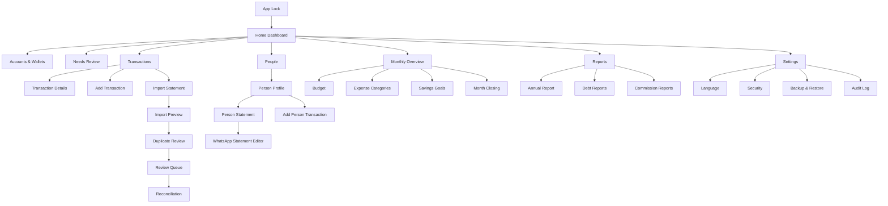
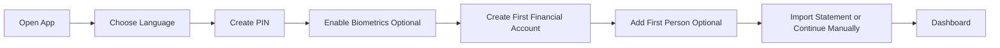
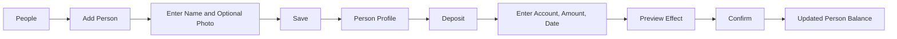
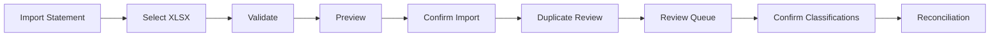
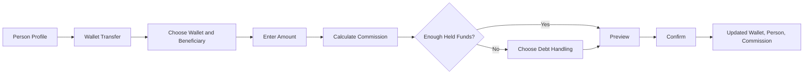
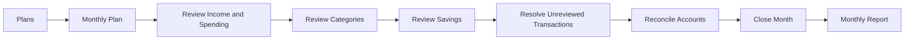

# Phase 03 — User Experience, Screen Flows, and Design System

**Project:** Salah Finance Manager  
**Document:** User Experience, Screen Flows, and Design System  
**Status:** Approved UX Baseline  
**Date:** 23 July 2026  
**Product Owner:** Salah Abu Saif  
**Target Platform:** Android  
**UI Framework:** Jetpack Compose with Material 3  
**Supported Languages:** Arabic and English  
**Default Language:** Arabic  
**Layout Directions:** RTL and LTR  
**Visual Reference:** Modern purple-gradient personal finance application selected during product discovery  

---

## 1. Phase Objective

This phase converts the approved product requirements and technical architecture into a complete user experience specification.

It defines:

- The information architecture.
- Main navigation.
- Screen inventory.
- User journeys.
- Arabic RTL and English LTR behavior.
- Dashboard hierarchy.
- People and person-account experiences.
- Transaction entry and review flows.
- Statement import.
- Duplicate review.
- Reconciliation.
- Budgeting and savings.
- Reports and WhatsApp statements.
- Settings and security.
- Design tokens.
- Typography.
- Color system.
- Spacing.
- Components.
- Empty, loading, success, warning, and error states.
- Accessibility.
- Responsive behavior.
- UX testing and acceptance criteria.

No visual implementation in Android Studio should begin until this phase is approved.

---

## 2. UX Vision

The application must feel like a trusted private financial assistant.

The experience should be:

- Clear.
- Calm.
- Modern.
- Fast.
- Visually professional.
- Easy to review.
- Safe for financial actions.
- Suitable for daily use.
- Comfortable in Arabic.
- Equally complete in English.
- Designed for one-handed use where possible.
- Honest about uncertainty and review requirements.

The application must never feel like an accounting system designed for accountants.

The internal ledger can be sophisticated, but the user-facing language must remain simple:

- “Money they have with me.”
- “Money they owe me.”
- “Deposit.”
- “Withdrawal.”
- “Loan.”
- “Repayment.”
- “Transfer.”
- “Commission.”
- “Needs review.”
- “Balance difference.”

---

## 3. Visual Direction

The selected reference establishes the following design direction:

- Large purple-gradient dashboard header.
- White rounded cards.
- Clean light background.
- Strong numeric hierarchy.
- Simple financial charts.
- Compact bottom navigation.
- Central floating action button.
- Modern line icons.
- Soft shadows.
- Clear category colors.
- Minimal visual noise.
- Friendly but professional tone.

The application will use the reference as inspiration only.

It must not copy:

- Exact layout.
- Exact icons.
- Exact illustrations.
- Exact typography.
- Exact chart composition.
- Proprietary visual details.

---

## 4. UX Principles

### 4.1 Financial Clarity

Every screen must answer one primary question.

Examples:

- Dashboard: “What is my financial position now?”
- People: “Who has money with me, and who owes me?”
- Person profile: “What is this person’s exact position?”
- Review queue: “Which new movements need my decision?”
- Budget: “How much have I spent and what remains?”
- Reconciliation: “Why does the app not match the bank?”

### 4.2 Progressive Disclosure

Show essential information first.

Advanced details such as:

- Debit and credit postings.
- Import fingerprints.
- Parser warnings.
- Audit metadata.
- Exchange calculations.

must remain available but hidden from the primary workflow.

### 4.3 Safe Defaults

The application should prefer:

- Draft before posting when information is incomplete.
- Suggestion before automatic classification.
- Confirmation before creating debt.
- Reversal instead of destructive edits.
- Explanation before resolving reconciliation differences.

### 4.4 Reviewability

The user must be able to understand why a transaction affects a balance.

Every transaction detail should explain:

- Original amount.
- Commission.
- Account used.
- Person.
- Beneficiary.
- Final amount charged.
- Financial effect.
- Import source.
- Review status.

### 4.5 Bilingual Equality

Arabic is not a translation added after English.

Both languages must receive:

- Complete navigation.
- Correct terminology.
- Correct alignment.
- Correct icon direction.
- Proper amount formatting.
- Full testing.
- Equal feature coverage.

### 4.6 Vertical Feature Completion

A feature is not complete unless the full user flow works from UI to database and back.

For example, “Add Person” is complete only when:

- The user opens the screen.
- Enters valid data.
- Adds an optional photo.
- Saves.
- Sees the new person.
- Searches for the person.
- Opens the person profile.
- Restarts the app and still sees the data.
- Automated tests pass.

---

## 5. Primary User

The first release has one primary user:

> Salah, the owner of the application and the person responsible for reviewing, categorizing, and reconciling financial movements.

The user:

- Manages personal finances.
- Holds money for other people.
- Lends money.
- Owes money.
- Uses ILS and USD.
- Uses Bank of Palestine.
- Uses PalPay and Jawwal Pay.
- Imports updated statements frequently.
- Generates WhatsApp account statements.
- Needs monthly and annual reports.
- Needs accurate records more than decorative visuals.

---

## 6. Information Architecture



---

## 7. Main Navigation

The bottom navigation contains five destinations:

1. **Home**
2. **Transactions**
3. **People**
4. **Plans**
5. **Settings**

A central floating action button provides quick access to common actions.

### 7.1 Floating Action Button

Tapping the button opens a quick-action sheet:

- Add transaction.
- Add person.
- Add income.
- Add expense.
- Add loan.
- Record repayment.
- Add savings contribution.
- Import statement.

The last used action may appear first, but the ordering must remain predictable.

### 7.2 Navigation Rules

- Bottom destinations preserve their own navigation state.
- Back returns to the previous screen.
- Back from the root tab does not unexpectedly switch tabs.
- Unsaved financial forms require confirmation before leaving.
- Deep links are outside the first release.
- Navigation labels must be visible, not icon-only.
- Selected tab uses primary color and stronger icon treatment.
- Navigation must work identically in RTL and LTR, with layout mirroring where appropriate.

---

## 8. Screen Inventory

### Authentication and Security

1. App lock.
2. PIN setup.
3. Biometric setup.
4. Lock timeout settings.

### Dashboard and Accounts

5. Home dashboard.
6. Accounts and wallets.
7. Financial account details.
8. Reconciliation summary.

### People

9. People list.
10. Add person.
11. Edit person.
12. Person profile.
13. Person balance details.
14. Person transaction history.
15. Person statement.
16. WhatsApp statement editor.

### Transactions

17. Transactions list.
18. Transaction details.
19. Add transaction.
20. Edit draft transaction.
21. Reverse transaction.
22. Correction flow.
23. Filter transactions.

### Import and Review

24. Select statement file.
25. Import validation.
26. Import preview.
27. Duplicate review.
28. Review queue.
29. Classification editor.
30. Import batch result.

### Reconciliation

31. Start reconciliation.
32. Reconciliation difference.
33. Unexplained items.
34. Reconciliation adjustment.
35. Reconciliation success.

### Budget and Savings

36. Monthly plan.
37. Budget category details.
38. Add or edit budget.
39. Expense categories.
40. Savings goals.
41. Savings goal details.
42. Add savings contribution.
43. Close month.

### Reports

44. Reports home.
45. Monthly report.
46. Annual report.
47. Debt report.
48. Funds held report.
49. Commission report.
50. Net worth report.

### Settings and Maintenance

51. Settings.
52. Language and region.
53. Appearance.
54. Security.
55. Backup and restore.
56. Backup history.
57. Audit log.
58. Data and privacy.
59. About the application.

---

## 9. Home Dashboard

### 9.1 Primary Purpose

Answer:

> What is my current financial position, and what needs my attention?

### 9.2 Layout

The dashboard uses a vertically scrollable layout.

#### Header

- Greeting.
- Current period selector.
- Profile avatar or initials.
- Notification or attention indicator.
- Optional privacy toggle to hide amounts.

#### Hero Balance Card

The purple-gradient hero card displays:

- Personal net position for the selected currency.
- Currency switcher: ILS / USD.
- Comparison with previous period.
- Short explanation.
- Shortcut to account details.

The card must not mix ILS and USD automatically.

#### Money Summary Cards

Two primary cards:

- Personal income.
- Personal expenses.

Additional compact cards:

- Funds held for others.
- Receivables.
- Payables.
- Savings.

#### Attention Card

If action is needed:

- Unreviewed transactions.
- Reconciliation difference.
- Overdue debts.
- Budget warning.
- Backup warning.

Only one highest-priority attention card appears prominently. Others remain in a list.

#### Recent Transactions

Shows:

- Date.
- Icon.
- Person or category.
- Account.
- Amount.
- Status.
- Commission indicator if applicable.

#### Monthly Snapshot

Shows:

- Salary.
- Spending.
- Remaining budget.
- Savings.
- Safe daily spend.

### 9.3 Dashboard States

#### New User

- No accounts.
- Guided setup.
- Add first account.
- Add first person.
- Import first statement.

#### No Activity

- Accounts exist.
- No monthly transactions.
- Explain how to add or import.

#### Review Required

- Display count.
- Show highest-value or oldest item.
- Direct action to review.

#### Reconciliation Difference

- Display difference amount.
- Explain which account.
- Direct action to reconciliation.

---

## 10. Accounts and Wallets

### 10.1 Accounts List

Each account card contains:

- Account icon.
- Account name.
- Currency.
- Calculated balance.
- Last statement balance.
- Reconciliation status.
- Last activity date.

Supported visual types:

- Bank.
- Wallet.
- Cash.
- Savings.

### 10.2 Account Details

Contains:

- Balance.
- Currency.
- Institution.
- Masked account number.
- Last reconciliation.
- Recent transactions.
- Monthly movement.
- Import statement button.
- Reconcile button.
- Edit metadata.
- Archive action.

The account balance is read-only and transaction-driven.

---

## 11. People List

### 11.1 Purpose

Answer:

> Who has money with me, and who owes me?

### 11.2 Layout

Header:

- Screen title.
- Search field.
- Filter icon.
- Add person button.

Summary chips:

- All.
- Has money with me.
- Owes me.
- Both.
- Needs review.
- Archived.

Each person card displays:

- Photo or initials avatar.
- Name.
- Optional nickname.
- “Has with me” amount.
- “Owes me” amount.
- Currency badges.
- Last activity.
- Status badge.

### 11.3 Person Card Rules

- Never show only a net amount.
- Show both sides when both exist.
- Keep ILS and USD separate.
- Use labels and not colors alone.
- Highlight overdue debts with text.
- Do not expose private notes in the list.

### 11.4 Search

Search matches:

- Full name.
- Nickname.
- Alias.
- Phone number where allowed.

Arabic normalization should support:

- Alef variants.
- Taa marbuta and haa carefully.
- Common whitespace differences.
- Diacritics removal for search only.

Original names remain unchanged.

---

## 12. Add and Edit Person

### 12.1 Fields

Required:

- Display name.

Optional:

- Photo.
- Person or organization.
- Nickname.
- Phone number.
- Alternative names.
- Notes.
- Create financial account toggle.

### 12.2 Photo Flow

- Camera.
- Gallery.
- Crop.
- Confirm.
- Remove.

If no photo exists:

- Generate initials avatar.
- Choose deterministic background token from the name.

### 12.3 Validation

- Name cannot be blank.
- Duplicate exact name produces warning.
- Alias duplicate across people produces review warning.
- Phone number is normalized but original formatting is preserved.
- Save remains disabled while required data is invalid.

### 12.4 Success

After save:

- Show success snackbar.
- Navigate to person profile.
- Display the created data immediately.

---

## 13. Person Profile

### 13.1 Header

Contains:

- Photo.
- Name.
- Nickname.
- Account status.
- Edit action.
- More actions.

### 13.2 Currency Tabs

- ILS.
- USD.

Each tab displays:

- Money they have with the user.
- Money they owe the user.
- Optional net.
- Last movement date.

### 13.3 Quick Actions

- Deposit.
- Withdrawal.
- Loan.
- Repayment.
- Wallet transfer.
- Bank transfer.
- Statement.

### 13.4 Transaction Timeline

Each transaction item contains:

- Date.
- Type.
- Beneficiary.
- Account.
- Original amount.
- Commission.
- Final impact.
- Status.

### 13.5 Statement Action

The user chooses:

- Currency.
- Date range.
- Include opening balance.
- Include commission.
- Include beneficiary.
- Include notes.
- Language.
- Output type.

Then previews the statement before sharing.

---

## 14. Transactions List

### 14.1 Header

- Title.
- Search.
- Date period.
- Filter.
- Add transaction.

### 14.2 Filter Options

- Date.
- Currency.
- Account.
- Person.
- Type.
- Category.
- Review status.
- Import source.
- Reconciled status.
- Amount range.

### 14.3 Grouping

Default grouping:

- Today.
- Yesterday.
- Earlier dates.

Alternative:

- By month.
- By person.
- By account.
- By category.

### 14.4 Transaction Item

Displays:

- Leading icon or person avatar.
- Main title.
- Supporting account or beneficiary.
- Amount.
- Currency.
- Commission badge.
- Status badge.
- Imported indicator.

---

## 15. Add Transaction Flow

### 15.1 Step 1 — Choose Action

- Income.
- Expense.
- Deposit for person.
- Withdrawal for person.
- Loan.
- Repayment.
- Internal transfer.
- Currency exchange.
- Wallet transfer.
- Correction.

### 15.2 Step 2 — Enter Financial Data

Depending on action:

- Amount.
- Currency.
- Source account.
- Destination account.
- Person.
- Beneficiary.
- Category.
- Date.
- Commission.
- Notes.

### 15.3 Step 3 — Preview Effect

Before posting, show plain language:

> PalPay will decrease by 200 ILS.  
> Hamoud’s held balance will decrease by 201.5 ILS.  
> Wallet commission income will increase by 1.5 ILS.

### 15.4 Step 4 — Confirm

The confirmation button uses action language:

- Post deposit.
- Record withdrawal.
- Record loan.
- Record repayment.
- Confirm transfer.

Do not use generic “Submit” for financial actions.

### 15.5 Draft Behavior

If the user exits an incomplete financial form:

- Offer Save draft.
- Discard.
- Continue editing.

---

## 16. Wallet Transfer Flow

### 16.1 Inputs

- Wallet.
- Person.
- Beneficiary.
- Original amount.
- Date.
- Commission rule.
- Optional note.

### 16.2 Commission Preview

Show:

- Transfer amount.
- Commission.
- Total charged to person.

### 16.3 Insufficient Held Balance

When held funds are insufficient:

Options:

1. Cancel.
2. Use held funds and create remaining debt.
3. Create full debt.
4. Choose another source.

Creating debt requires explicit confirmation.

---

## 17. Statement Import Flow

### 17.1 Select File

Use Android document picker.

Show supported format:

- XLSX.

Show privacy note:

- File remains on the device.
- Bank credentials are never requested.

### 17.2 Validate File

Progress stages:

- Reading file.
- Detecting account.
- Detecting currency.
- Reading rows.
- Checking duplicates.
- Preparing preview.

### 17.3 Import Preview

Summary cards:

- Total rows.
- New rows.
- Duplicates.
- Warnings.
- Errors.
- Detected account.
- Statement period.

Tabs:

- New.
- Duplicate.
- Warning.
- Error.

### 17.4 Confirm Import

The confirm screen explains:

- Raw data will be preserved.
- New rows will enter review.
- No uncertain transaction will be posted automatically.

### 17.5 Import Result

Shows:

- Imported rows.
- Skipped duplicates.
- Warnings.
- Failed rows.
- Review button.

---

## 18. Duplicate Review

### 18.1 Exact Duplicate

Show:

- New row.
- Existing row.
- Match reason.
- Reference number.
- Amount.
- Date.

Default action:

- Keep existing.
- Skip new.

### 18.2 Probable Duplicate

Show comparison and allow:

- Treat as duplicate.
- Keep as separate.
- Defer decision.

Never automatically delete probable duplicates.

---

## 19. Review Queue

### 19.1 Purpose

Answer:

> Which imported movements still need my decision?

### 19.2 Review Card

Displays:

- Original description.
- Date.
- Debit or credit.
- Amount.
- Suggested person.
- Suggested beneficiary.
- Suggested type.
- Explanation.
- Confidence indicator.
- Original source.

Actions:

- Confirm.
- Edit.
- Exclude.
- Mark duplicate.
- Review later.

### 19.3 Batch Review

Allowed only when:

- Same deterministic rule.
- Same clear person mapping.
- Same transaction type.
- User explicitly selects rows.

The application must show the number and total value before batch confirmation.

---

## 20. Reconciliation Flow

### 20.1 Start

User selects:

- Financial account.
- Statement date.
- Real statement balance.

### 20.2 Compare

Display:

- Real balance.
- Calculated balance.
- Difference.
- Unreviewed amount.
- Excluded amount.
- Pending corrections.

### 20.3 Difference Explanation

Possible items:

- Missing transaction.
- Duplicate.
- Incorrect account.
- Incorrect date.
- Excluded row.
- Opening balance issue.
- Manual correction.

### 20.4 Success

When difference reaches zero:

- Show balanced state.
- Save reconciliation.
- Display summary.
- Offer export or continue.

---

## 21. Plans Module

“Plans” combines:

- Monthly budget.
- Savings goals.
- Planned commitments.

### 21.1 Plans Home

Displays:

- Current monthly spending.
- Remaining budget.
- Savings target progress.
- Planned commitments.
- Warnings.

### 21.2 Monthly Budget

Contains:

- Salary.
- Additional income.
- Spending limit.
- Savings target.
- Category budgets.
- Safe daily spend.

### 21.3 Savings Goals

Each goal card contains:

- Icon.
- Goal name.
- Target.
- Current amount.
- Progress.
- Remaining amount.
- Target date.
- Status.

---

## 22. Reports

### 22.1 Reports Home

Report cards:

- Monthly.
- Annual.
- People.
- Debts.
- Funds held.
- Commissions.
- Net worth.
- Reconciliation.

### 22.2 Report Filters

- Period.
- Currency.
- Account.
- Person.
- Category.

### 22.3 Charts

Preferred:

- Donut for category distribution.
- Bar chart for monthly comparison.
- Line chart for net worth trend.
- Progress bar for savings.

Charts must always provide a textual summary.

---

## 23. WhatsApp Statement Editor

### 23.1 Generation Options

- Language.
- Person.
- Currency.
- Date range.
- Greeting.
- Opening balance.
- Deposits.
- Withdrawals.
- Commissions.
- Loans.
- Repayments.
- Closing balance.
- Notes.

### 23.2 Editor

The generated message is editable.

Actions:

- Copy.
- Share.
- Save draft.
- Regenerate.
- Reset changes.

The application does not send automatically.

---

## 24. Settings

Sections:

### General

- Language.
- Number format.
- Date format.
- Theme.
- Default currency.
- Time zone.

### Financial

- Wallet commission rules.
- Default accounts.
- Categories.
- Statement templates.
- Month start preference.

### Security

- PIN.
- Biometrics.
- Lock timeout.
- Hide amounts.
- Screenshot protection.

### Data

- Backup.
- Restore.
- Export.
- Audit log.
- Privacy.
- Storage usage.

### About

- App version.
- Documentation.
- Open-source notices.
- Contact or feedback later.

---

## 25. Arabic RTL Rules

### 25.1 Layout

- Main reading direction is right to left.
- Leading content appears on the right.
- Back arrow points to the right.
- Forward or next indicators mirror.
- Bottom navigation order remains semantically consistent and is visually mirrored.
- Amount signs remain readable.
- Charts keep numeric direction clear.

### 25.2 Text

- Arabic labels align right.
- English names inside Arabic screens remain legible.
- Bank descriptions may contain mixed Arabic and English.
- Bidirectional text must be tested.
- Account numbers remain LTR.
- Currency codes remain readable.

### 25.3 Numbers

The user may choose:

- Arabic-Indic digits.
- Latin digits.

The default should be Latin digits for financial precision unless the user changes it.

---

## 26. English LTR Rules

- Standard left-to-right navigation.
- Back arrow points left.
- Labels align left.
- Amount columns remain aligned consistently.
- Arabic person names remain unchanged.
- Mixed descriptions must not break card layout.

---

## 27. Design Tokens

### 27.1 Color Tokens

#### Light Theme

| Token | Hex | Use |
|---|---|---|
| `primary` | `#7C4DFF` | Main actions |
| `primaryDark` | `#5B2FD6` | Gradient and pressed |
| `primaryLight` | `#B49CFF` | Soft accents |
| `secondary` | `#FF7043` | Plans and attention accents |
| `success` | `#21B573` | Income and positive states |
| `error` | `#E5484D` | Negative and critical states |
| `warning` | `#F59E0B` | Needs review |
| `info` | `#2F9DF4` | Informational states |
| `background` | `#F7F7FA` | App background |
| `surface` | `#FFFFFF` | Cards |
| `surfaceVariant` | `#F0EFF5` | Secondary cards |
| `textPrimary` | `#15141A` | Primary text |
| `textSecondary` | `#74717A` | Secondary text |
| `divider` | `#E7E5EC` | Dividers |

#### Hero Gradient

- Start: `#9B6BFF`
- Middle: `#7C4DFF`
- End: `#5B2FD6`

#### Dark Theme Direction

Dark theme is specified but may be implemented after the first stable light theme.

| Token | Hex |
|---|---|
| `backgroundDark` | `#111014` |
| `surfaceDark` | `#1B1920` |
| `surfaceVariantDark` | `#27242D` |
| `textPrimaryDark` | `#F7F5FA` |
| `textSecondaryDark` | `#B8B3C1` |

### 27.2 Typography

Recommended fonts:

- Arabic: **Tajawal**
- English and numbers: **Inter**

If adding custom fonts increases early project risk, use the platform font temporarily but keep typography tokens stable.

Type scale:

| Token | Size | Weight | Use |
|---|---:|---:|---|
| `displayLarge` | 36sp | 700 | Hero balances |
| `displayMedium` | 30sp | 700 | Main totals |
| `headlineLarge` | 24sp | 700 | Screen titles |
| `headlineMedium` | 20sp | 700 | Section titles |
| `titleLarge` | 18sp | 600 | Card titles |
| `titleMedium` | 16sp | 600 | List titles |
| `bodyLarge` | 16sp | 400 | Main body |
| `bodyMedium` | 14sp | 400 | Supporting text |
| `labelLarge` | 14sp | 600 | Buttons |
| `labelMedium` | 12sp | 600 | Badges |
| `caption` | 11sp | 400 | Metadata |

### 27.3 Spacing

Base unit: 4dp.

Tokens:

- `space1` = 4dp
- `space2` = 8dp
- `space3` = 12dp
- `space4` = 16dp
- `space5` = 20dp
- `space6` = 24dp
- `space8` = 32dp
- `space10` = 40dp

### 27.4 Radius

- Small: 8dp.
- Medium: 12dp.
- Large: 18dp.
- Extra large: 24dp.
- Pill: 999dp.

### 27.5 Elevation

Use minimal elevation.

- Card default: 1dp.
- Floating action: 6dp.
- Modal: 8dp.
- Avoid strong shadows.

### 27.6 Icon Size

- Small: 16dp.
- Standard: 24dp.
- Large: 32dp.
- Avatar action: 40dp.

### 27.7 Touch Targets

Minimum touch target:

- 48dp × 48dp.

---

## 28. Component Catalog

Required reusable Compose components:

### Structure

- `FinanceTopAppBar`
- `FinanceBottomBar`
- `FinanceScaffold`
- `FinanceSectionHeader`
- `FinanceFloatingActionButton`

### Money

- `MoneyText`
- `HiddenMoneyText`
- `BalanceHeroCard`
- `MoneySummaryCard`
- `CurrencyBadge`
- `BalanceStatusBadge`
- `CommissionBreakdown`

### People

- `PersonAvatar`
- `PersonCard`
- `PersonBalanceSummary`
- `PersonQuickActions`
- `AliasChip`

### Transactions

- `TransactionListItem`
- `TransactionStatusBadge`
- `TransactionTypeIcon`
- `TransactionEffectPreview`
- `TransactionFilterBar`

### Import and Review

- `ImportProgressCard`
- `ImportSummaryCard`
- `RawStatementRowCard`
- `DuplicateComparisonCard`
- `ReviewSuggestionCard`
- `ConfidenceIndicator`

### Budget and Savings

- `BudgetProgressCard`
- `CategoryBudgetRow`
- `SavingsGoalCard`
- `SafeDailySpendCard`

### Feedback

- `EmptyState`
- `ErrorState`
- `LoadingSkeleton`
- `InlineWarning`
- `SuccessBanner`
- `ConfirmationDialog`
- `DestructiveActionDialog`

### Forms

- `MoneyInputField`
- `PersonSelector`
- `AccountSelector`
- `CurrencySelector`
- `DateSelector`
- `BeneficiaryField`
- `NotesField`

---

## 29. Component Behavior Rules

### MoneyText

- Accepts minor units and currency.
- Formats by locale.
- Supports positive, negative, and neutral states.
- Does not directly accept `Double`.
- Supports hidden mode.
- Uses semantic content descriptions.

### MoneyInputField

- Prevents invalid decimal precision.
- Rejects non-financial characters.
- Supports paste.
- Maintains cursor position.
- Shows currency.
- Converts to minor units safely.
- Does not use floating-point parsing.

### PersonAvatar

Priority:

1. Photo.
2. Initials.
3. Generic fallback.

### TransactionStatusBadge

Statuses:

- Draft.
- Needs review.
- Posted.
- Reconciled.
- Reversed.
- Excluded.
- Duplicate.

---

## 30. Empty States

Every list screen requires an intentional empty state.

Examples:

### No People

Title:

> No people added yet.

Action:

> Add first person.

### No Transactions

Title:

> No transactions in this period.

Actions:

- Add transaction.
- Import statement.

### No Budget

Title:

> No monthly plan created.

Action:

> Create monthly plan.

### No Review Items

Title:

> Everything is reviewed.

Supporting text:

> There are no imported movements waiting for your decision.

---

## 31. Loading States

Use skeleton loading for:

- Dashboard cards.
- People list.
- Transaction list.
- Reports.
- Person profile.

Use progress indicators for:

- File parsing.
- Backup.
- Restore.
- Report generation.

Long operations must show:

- Current stage.
- Progress when measurable.
- Cancel option when safe.
- Clear completion result.

---

## 32. Error States

Errors must be actionable.

Bad:

> Something went wrong.

Good:

> The statement file could not be read because the expected transaction columns were not found.

Actions:

- Try again.
- Choose another file.
- View technical details.
- Keep existing data unchanged.

Financial write errors must confirm that no partial posting occurred.

---

## 33. Confirmation Rules

Confirmation is required for:

- Creating debt from insufficient held funds.
- Posting a financial transaction.
- Reversing a posted transaction.
- Correcting a reconciled transaction.
- Reopening a closed month.
- Deleting a person with financial history.
- Restoring a backup over current data.
- Excluding an imported row.
- Accepting a probable duplicate decision.

Confirmation is not required for:

- Opening filters.
- Searching.
- Copying a statement.
- Changing a non-financial display setting.

---

## 34. Accessibility

The application must support:

- Minimum 48dp touch targets.
- Screen reader labels.
- Logical focus order.
- Sufficient color contrast.
- Text scaling.
- No information conveyed by color alone.
- Clear error messages.
- Semantic headings.
- Accessible chart summaries.
- Reduced motion where supported.
- Support for switch access.
- Biometric flows with PIN fallback.

Important financial values must have full spoken descriptions.

Example:

> “Negative one thousand one hundred forty-eight Israeli shekels.”

---

## 35. Responsive Layout

Primary target:

- Portrait phone.

Supported:

- Small phones.
- Standard phones.
- Large phones.
- Foldable inner displays.
- Tablets in a later optimized pass.

Rules:

- Use adaptive width classes.
- Do not hardcode screen widths.
- Cards may become two columns on larger width.
- Lists and details may use supporting panes on large screens.
- Financial forms remain single-column unless space clearly improves usability.

---

## 36. Privacy UX

Provide:

- Hide or show amounts.
- Lock app when backgrounded.
- Screenshot protection setting.
- Mask account numbers.
- Avoid financial values in notifications.
- Explain backup destination.
- Explain that bank credentials are never collected.

The dashboard amount visibility choice persists locally.

---

## 37. Content Style

Tone:

- Clear.
- Respectful.
- Calm.
- Direct.
- Non-technical.

Use verbs:

- Add.
- Record.
- Review.
- Confirm.
- Reconcile.
- Reverse.
- Restore.

Avoid:

- Submit.
- Execute.
- Commit transaction.
- Debit account.
- Credit account.

Accounting terms may appear only in advanced details.

---

## 38. Arabic Terminology Baseline

| English | Arabic |
|---|---|
| Home | الرئيسية |
| Transactions | الحركات |
| People | الأشخاص |
| Plans | الخطط |
| Settings | الإعدادات |
| Money they have with me | أموالهم الموجودة عندي |
| Money they owe me | المبالغ المستحقة لي |
| Deposit | إيداع |
| Withdrawal | سحب |
| Loan | قرض |
| Repayment | سداد |
| Commission | عمولة |
| Needs review | يحتاج مراجعة |
| Reconciliation | المطابقة |
| Savings goal | هدف ادخار |
| Monthly budget | الميزانية الشهرية |
| Statement | كشف حساب |
| Opening balance | الرصيد الافتتاحي |
| Closing balance | الرصيد الختامي |
| Beneficiary | المستفيد |
| Account | الحساب |
| Wallet | المحفظة |
| Income | الدخل |
| Expense | المصروف |
| Remaining | المتبقي |

Final Arabic terminology will be reviewed during implementation.

---

## 39. Main User Flows

### 39.1 First-Time Setup



### 39.2 Add Person and Deposit



### 39.3 Import and Review



### 39.4 Wallet Transfer



### 39.5 Monthly Review



---

## 40. UX Acceptance Scenarios

Phase 03 is accepted only when the documented UX supports the following:

1. Add a person in Arabic.
2. Add a person in English.
3. Add a photo and replace it.
4. View “has with me” and “owes me” separately.
5. View ILS and USD separately.
6. Record a person deposit.
7. Record a wallet transfer and preview commission.
8. Create debt only after explicit confirmation.
9. Import a Bank of Palestine statement.
10. Compare exact and probable duplicates.
11. Review an imported movement with explanation.
12. Reconcile an account to zero difference.
13. Create a monthly plan.
14. See remaining salary and safe daily spend.
15. Create and update a savings goal.
16. Generate an Arabic WhatsApp statement.
17. Generate an English WhatsApp statement.
18. Copy and edit the generated text.
19. Switch Arabic and English.
20. Use RTL and LTR navigation correctly.
21. Complete key flows with screen reader labels.
22. Understand errors without technical knowledge.
23. Hide amounts from the dashboard.
24. Restore a backup through a safe confirmation flow.

---

## 41. UX Testing Plan

### 41.1 Design Review

Review:

- Hierarchy.
- Consistency.
- Financial clarity.
- RTL.
- LTR.
- Accessibility.
- Error prevention.

### 41.2 Prototype Testing

Test clickable prototype tasks:

- Find a person.
- Determine how much they have.
- Determine how much they owe.
- Record a 200 ILS wallet transfer.
- Identify the commission.
- Import a statement.
- Find review items.
- Understand reconciliation difference.
- Check remaining monthly salary.
- Generate a WhatsApp statement.

### 41.3 Implementation Testing

Each completed vertical slice must include:

- Screenshot in Arabic.
- Screenshot in English.
- RTL verification.
- LTR verification.
- UI test.
- Accessibility review.
- Empty state.
- Loading state where relevant.
- Error state.
- Success state.

---

## 42. Phase 03 Documentation Structure

```text
docs/
├── phases/
│   └── 03-user-experience-screen-flows-and-design-system.md
├── decisions/
│   ├── ADR-005-bilingual-rtl-ltr-foundation.md
│   ├── ADR-006-design-system-and-components.md
│   └── ADR-007-navigation-and-vertical-flows.md
├── design-system/
│   ├── design-tokens.md
│   └── component-catalog.md
├── testing/
│   └── phase-03-ux-acceptance-scenarios.md
├── screenshots/
│   └── references/
│       └── finance-dashboard-reference.png
├── screen-map.md
└── linkedin/
    └── phase-03-progress-note.md
```

---

## 43. Phase 03 Acceptance Criteria

Phase 03 is complete when:

- [x] UX vision is documented.
- [x] Information architecture is defined.
- [x] Bottom navigation is defined.
- [x] Main screen inventory is complete.
- [x] Dashboard hierarchy is defined.
- [x] Accounts and wallet flows are defined.
- [x] People list and person profile are defined.
- [x] Transaction creation is defined.
- [x] Wallet commission UX is defined.
- [x] Import and duplicate review are defined.
- [x] Review queue is defined.
- [x] Reconciliation is defined.
- [x] Budget and savings flows are defined.
- [x] Reports and WhatsApp statement editor are defined.
- [x] Arabic RTL rules are defined.
- [x] English LTR rules are defined.
- [x] Design tokens are defined.
- [x] Typography is defined.
- [x] Reusable components are defined.
- [x] Empty, loading, error, and confirmation states are defined.
- [x] Accessibility requirements are defined.
- [x] Responsive behavior is defined.
- [x] Main user flows are defined.
- [x] UX acceptance scenarios are defined.
- [x] Reference image is preserved in project documentation.

---

## 44. Approved Phase 03 Decisions

1. Use the selected modern purple finance design as visual inspiration.
2. Use Arabic as the default language.
3. Build RTL and LTR from the beginning.
4. Use five bottom navigation destinations.
5. Use a central quick-action button.
6. Keep ILS and USD visually separate.
7. Show “has with me” and “owes me” separately.
8. Provide optional profile photos.
9. Show financial effect preview before posting.
10. Require confirmation before automatically creating debt.
11. Preserve original imported text in review screens.
12. Explain all classification suggestions.
13. Make generated WhatsApp text editable.
14. Use accessible colors, labels, and touch targets.
15. Implement every feature in Arabic and English within the same vertical slice.

---

## 45. Next Phase

# Phase 04 — Android Project Bootstrap and Foundation

Phase 04 will be executed through Codex and Android Studio.

It will include:

- Create Android Studio project.
- Configure Kotlin DSL.
- Add version catalog.
- Configure Compose and Material 3.
- Add Hilt.
- Add Room.
- Add DataStore.
- Add WorkManager.
- Create the planned modules.
- Create the design system foundation.
- Add Arabic and English resources.
- Add RTL and LTR verification screen.
- Add navigation shell.
- Add app theme.
- Add CI-friendly Gradle tasks.
- Add baseline unit and UI tests.
- Add documentation and screenshots.
- Verify build, lint, tests, and emulator launch.

The project must display a working bilingual application shell before Phase 04 is accepted.
